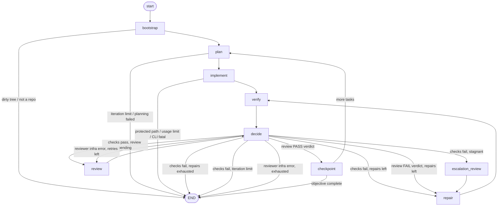

# agent_harness — local autonomous engineering-agent harness (V0)

A small orchestration loop that drives an implement → verify → review →
checkpoint cycle over **this** repository, using the local `claude` and `codex`
CLIs as subprocess workers. It is isolated from the Tailor application: it never
imports application code and never edits it itself — only the Claude worker does.

**V0 status:** wired and unit-tested with mocked subprocesses; a `--dry-run`
mode; one real read-only Codex smoke. No autonomous Claude run has been
performed. Activate deliberately.

## Architecture

| Concern | Module |
|---|---|
| Config (`agent.toml`) + CLI resolution | `config.py` |
| Typed, serialisable graph state | `state.py` |
| LangGraph graph: nodes + cyclic edges | `graph.py` |
| Deterministic project checks | `verifier.py` |
| Git introspection + checkpoint commits | `git_tools.py` |
| Recoverable state under `.agent/` (JSON, no DB) | `persistence.py` |
| `claude` subprocess worker (plan / implement / repair) | `workers/claude.py` |
| `codex` subprocess worker (review / escalate) | `workers/codex.py` |
| Shared subprocess plumbing (env scrub, timeout, classify) | `workers/base.py` |
| CLI entry point | `cli.py` / `__main__.py` |

- The **writer** (`claude`) is an untrusted transformation step. The
  **verifier** (deterministic exit codes) is the source of truth. A non-zero
  check exit always overrides any worker's claim of success — models never
  decide whether tests passed.
- The **reviewer** (`codex`, read-only) produces a schema-validated verdict.
  A `fail` verdict routes to repair. A reviewer *infrastructure* failure
  (timeout, crash, malformed JSON) is **not** an application failure and never
  routes to repair — it retries once, then stops.
- Git belongs to the orchestrator. The workers never run git. The harness never
  pushes, resets, rebases, rewrites history, deletes branches, or uses
  `git add -A`.

## The graph



Loops live entirely in edges — nodes never recurse. `decide` is the only
router; because LangGraph does not persist mutations made inside conditional
edge functions, the routing decision (and any stop reason) is computed in the
`decide` **node** and merely read by the edge function.

### Stop reasons

`SUCCESS`, `ITERATION_LIMIT`, `REPAIR_LIMIT`, `NO_PROGRESS`,
`STAGNATION_UNRESOLVED`, `PLANNING_FAILED`, `REVIEWER_ERROR`,
`REVIEW_COVERAGE_GAP`, `PROTECTED_PATH_MODIFIED`, `DIRTY_WORKTREE`,
`UNEXPECTED_WORKTREE_STATE`, `EXPECTED_HEAD_MOVED`, `DETACHED_HEAD`,
`CONFIG_INVALID`, `UNSAFE_RESUME_STATE`, `STATE_CORRUPT`, `CLI_FATAL`,
`USAGE_LIMIT`, `USER_ABORT`.

### V0.1 hardening (safe-for-one-guided-run pass)

- **Verification actually runs.** `[checks]` is executed as configured and an
  empty `[checks]` list is rejected (`config.require_runnable` / `CONFIG_INVALID`).
- **A no-op is never success.** A writer iteration that produces no *attributable*
  repository change does not complete the task; after `max_repairs_per_task`
  such iterations the run stops `NO_PROGRESS`. No empty commits.
- **Git ownership is attributed, not absorbed.** Before each writer the worktree
  is snapshotted (content hashes, NUL-safe path parsing); only paths whose
  content actually changed during that call join `owned_paths`. Unrelated
  pre-existing / concurrent changes stop the run rather than being staged.
- **Expected-HEAD invariant.** HEAD is checked against `expected_head` before
  every writer and before every checkpoint; harness commits advance it; any
  other movement stops the run (`EXPECTED_HEAD_MOVED`). Detached HEAD and a
  default branch are rejected at checkpoint time too.
- **Crash-safe checkpoint.** Checkpoint records an explicit intent
  (`intended` → commit → `committed` → bookkeeping), persisted around the
  non-idempotent commit. On resume it retries the commit, adopts an
  already-made commit (matched by parent + `[run <id>]` marker), or stops.
- **Review covers what checkpoint commits.** The reviewer sees a diff built
  from every owned path including brand-new untracked files
  (`git diff --no-index`, no index mutation); checkpoint refuses if
  `owned_paths ⊄ reviewed_paths` (`REVIEW_COVERAGE_GAP`).
- **Reviewer output is untrusted.** Local Pydantic models forbid unknown
  fields, reject bad enums, and enforce semantics (a `pass` cannot carry
  blocking severity; a `fail` must carry findings + non-`none` severity). Any
  malformed/infra failure is `infra_error` — retried once, then
  `REVIEWER_ERROR`; it is never interpreted as `PASS` and never routed to
  Claude repair.
- **Usage limits propagate from every role** — planning, implement, repair,
  review, escalation — to `USAGE_LIMIT`, and no further paid worker runs.
- **Recursion budget** is derived from the configured limits
  (`recursion_budget()`), so LangGraph's technical limit can never undercut the
  logical state-machine limits.
- **Single-run lock.** A real `fcntl.flock` on `.agent/harness.lock`; a second
  process exits cleanly. The kernel frees it if the holder dies.
- **Corrupt `.agent/state.json`** raises `STATE_CORRUPT` on resume and is left
  untouched for inspection.

## Setup

```bash
python3 -m venv agent_harness/.venv
agent_harness/.venv/bin/pip install -r agent_harness/requirements.txt
```

The Tailor application has **no** dependencies; keep running its own suite with a
bare interpreter (`python3 -m unittest discover -s tests`). The harness deps
(langgraph, pydantic, rich) live only in `agent_harness/.venv` (gitignored).

## Authentication assumptions

- Uses the **existing** local CLI auth: Claude Pro (`claude`) and ChatGPT Plus
  (`codex`). No `ANTHROPIC_API_KEY` / `OPENAI_API_KEY` — the harness actively
  **removes** those from the child process environment before launching a
  worker.
- The CLIs are not on `PATH` in this environment; they ship inside the VS Code
  extensions. Resolution order: `[claude]/[codex] executable` in `agent.toml`
  → `which` → `~/.vscode/extensions/<ext>-*/…` glob. Set the `executable` key
  if an extension update moves the binary.
- The installed `claude` (v2.1.263) has **no `--max-turns`** flag; the
  `*_max_turns` config keys are wired and forward-compatible but currently
  inert — `timeout_seconds` is the only outer bound.

## Configuration (`agent.toml`)

See `agent.toml` at the repo root. Highlights: `[agent]` limits;
`[claude] model` (default `claude-sonnet-5`) + per-role tool allowlists;
`[codex] review_model` / `checkpoint_model` (`gpt-5.6-luna` / `gpt-5.6-terra`)
+ `review_retries`; `[git]` `branch_required` / `require_clean_worktree`;
`[safety] protected_paths`; `[checks] commands` (the deterministic gate).

## Run

```bash
agent_harness/.venv/bin/python -m agent_harness "Fix all currently failing tests"
agent_harness/.venv/bin/python -m agent_harness --dry-run "objective"     # wiring check, no workers
agent_harness/.venv/bin/python -m agent_harness --max-iterations 5 "objective"
```

A fresh run requires: inside a git repo, on a non-`main`/`master` branch, with a
clean worktree. The terminal streams transitions
(`PLAN / IMPLEMENT / VERIFY / REPAIR / REVIEW / ESCALATION / CHECKPOINT`) with
the iteration number, and prints a final summary (status, stop reason,
iterations, completed tasks, commits, log dir).

## Resume

```bash
agent_harness/.venv/bin/python -m agent_harness --resume
```

Loads `.agent/state.json` and reconciles the worktree:

- A **checkpoint intent** (`intended`/`committed`) is reconciled first: retry the
  commit, adopt a commit that already landed, or stop if HEAD can't be matched.
- If a **write-capable** Claude call was in flight at crash time, it is **never
  replayed** — the run re-enters at deterministic `verify` on whatever is on
  disk.
- `expected_head` must still match HEAD, else stop (`EXPECTED_HEAD_MOVED`).
- Changes to a **protected path** → stop (`PROTECTED_PATH_MODIFIED`).
- Changes that cannot be attributed to the harness → stop
  (`UNEXPECTED_WORKTREE_STATE`). Nothing is discarded.
- A read-only worker in flight (review/escalation/planner) is simply re-run.
- Every persisted `next_node` maps to a defined re-entry; an unknown one stops
  (`UNSAFE_RESUME_STATE`). A corrupt state file raises `STATE_CORRUPT` and is
  left untouched.

V0 does not auto-wait after a usage limit — it saves state and exits so
`--resume` can pick up later.

## Safety model

These are **application-level guardrails, not an OS-level sandbox.** There is no
container, chroot, or seccomp:

- Claude runs with `--permission-mode plan` (planner, read-only) or
  `acceptEdits` (implement/repair), `--permission-prompts none`, `--add-dir`
  scoped to the repo, and a `--tools` allowlist that **excludes** `Bash`,
  `WebFetch`, `WebSearch`, and `Task`. No `--dangerously-skip-permissions`.
- Codex review/escalation runs `--sandbox read-only`.
- After every write-capable Claude call the harness diffs the worktree; any
  change to `agent_harness/`, `agent.toml`, `.git/`, or `.agent/` stops the run
  and is neither committed nor "repaired". `.git/` and `.agent/` coverage is
  best-effort (they don't appear in `git diff`; enforcement is via the tool
  allowlist and the explicit-pathspec checkpoint).
- The harness never pushes, deploys, touches remotes, rewrites history, deletes
  branches, or modifies files outside the repo root.

A determined or malfunctioning worker is not *physically* prevented from acting
outside these bounds. Run only in a repository you trust, on a feature branch,
with a clean tree.

## V0 limitations

- No `--max-turns` support in the installed `claude`; turn caps are inert.
- No auto-wait / auto-resume after subscription limits (save + exit only).
- No lint / typecheck checks (Tailor has none); `compileall` is the only static
  gate beyond the unit suite.
- Extension-bundled CLI paths are version-pinned; may need an `executable`
  override after an update.
- Single objective; linear task list from the planner (no task DAG, no
  parallelism); one worker at a time.
- Stagnation detection targets repeated **deterministic-check** failures; a pure
  review-verdict loop stops via `REPAIR_LIMIT` rather than escalation.
- Planner/reviewer quality is prompt-bounded; the loop trusts exit codes and
  schema-valid verdicts, not prose.
- LangGraph pulls `langchain-core` transitively — present but unused for model
  calls (all model access is CLI subprocess).
- **Concurrent same-file editing** by a human during a run cannot be attributed
  and stops the run conservatively (`UNEXPECTED_WORKTREE_STATE`). A dedicated
  per-run git worktree is the planned stronger isolation model.
- The "adopt an already-made commit" resume path matches on commit parent + a
  `[run <id>]` message marker; a hand-crafted matching commit could be adopted.
- End-to-end proof so far is `--dry-run`, the full mocked suite, the real
  configured checks, and one real read-only Codex review. A single **guided**
  end-to-end run is the next stage — not unattended operation.
