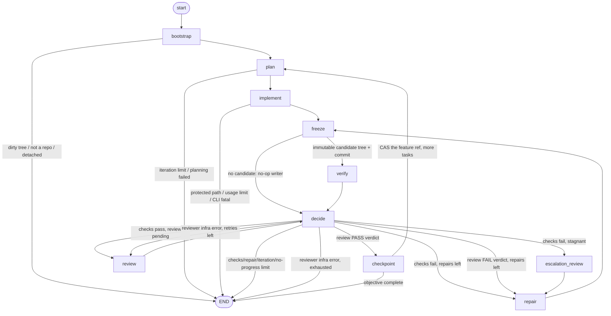

# agent_harness — local autonomous engineering-agent harness (V0)

A small orchestration loop that drives an implement → verify → review →
checkpoint cycle over **this** repository, using the local `claude` and `codex`
CLIs as subprocess workers. It is isolated from the Tailor application: it never
imports application code and never edits it itself — only the Claude worker does.

**V0 status:** wired and unit-tested with mocked subprocesses; a `--dry-run`
mode; one real read-only Codex smoke. No autonomous Claude run has been
performed. Activate deliberately.

## Architecture

| Concern | Module |
|---|---|
| Config (`agent.toml`) + CLI resolution | `config.py` |
| Typed, serialisable graph state | `state.py` |
| LangGraph graph: nodes + cyclic edges | `graph.py` |
| Deterministic project checks | `verifier.py` |
| Git introspection + checkpoint commits | `git_tools.py` |
| Recoverable state under `.agent/` (JSON, no DB) | `persistence.py` |
| ROLE → BACKEND → MODEL routing + invocation-boundary telemetry | `agents.py` |
| Engineering-agent execution telemetry (JSONL) | `telemetry.py` |
| `claude` backend adapter (plan / implement / repair) | `workers/claude.py` |
| `codex` backend adapter (review / escalate) | `workers/codex.py` |
| Shared subprocess plumbing (env scrub, timeout, classify) | `workers/base.py` |
| CLI entry point | `cli.py` / `__main__.py` |

### Role → backend → model (V1)

The graph asks `agents.AgentRouter` for a **role** — `planner`, `implementer`,
`repairer`, `routine_reviewer`, `escalation_reviewer` — and the router resolves
it to a **backend** (`claude_code` | `codex`, the only two adapters this version
ships) and a **model** from `[roles]` in `agent.toml`. Omit `[roles]` (or any
role) and the V0 default applies: planner/implementer/repairer →
`claude_code`/`[claude].model`; `routine_reviewer` → `codex`/`[codex].review_model`;
`escalation_reviewer` → `codex`/`[codex].checkpoint_model`. Provider argv stays
inside the adapters; orchestration never names a backend. Each invocation is
recorded (role, backend, model, timing, exit/classification) to
`.agent/runs/<run_id>/agents.jsonl`; a telemetry write failure never affects the
run. The router is a dispatch + telemetry seam only — verification stays
deterministic and independent, the writer still cannot review itself, and the
harness still owns the checkpoint.

- The **writer** (`claude`) is an untrusted transformation step. The
  **verifier** (deterministic exit codes) is the source of truth. A non-zero
  check exit always overrides any worker's claim of success — models never
  decide whether tests passed.
- The **reviewer** (`codex`, read-only) produces a schema-validated verdict.
  A `fail` verdict routes to repair. A reviewer *infrastructure* failure
  (timeout, crash, malformed JSON) is **not** an application failure and never
  routes to repair — it retries once, then stops.
- Git belongs to the orchestrator. The workers never run git. The harness never
  pushes, resets, rebases, rewrites history, deletes branches, or uses
  `git add -A`.

## The graph



Loops live entirely in edges — nodes never recurse. `decide` is the only
router; the routing decision (and any stop reason) is computed in the `decide`
**node** and merely read by the edge function.

### The checkpoint boundary is immutable Git objects (V0.1c)

`freeze` builds `<parent tree> + owned pathspec` in an **index isolated from the
user's `.git/index`** (`GIT_INDEX_FILE`) → `write-tree` → `candidate_tree_oid` →
`commit-tree` (deterministic author/committer) → `candidate_commit_oid` (an
unreachable object; the feature ref is untouched). `verify` runs the checks
against that exact commit in a throwaway `git worktree`. `review` diffs
`parent → candidate_commit`. `checkpoint` **atomically advances the persisted
feature-branch ref** with `git update-ref <ref> <candidate> <expected_parent>`
(compare-and-swap) — never `git add`/`git commit`, never the checked-out
branch, **never `refs/heads/main` or `refs/heads/master`**. Phases:
`none → candidate_frozen → verified → reviewed → ref_update_intent →
ref_updated`. The deterministic commit spec (parent, message, author,
committer) is persisted *together with* `candidate_tree_oid` at
`candidate_frozen`, so a crash before `candidate_commit_oid` is written rebuilds
the commit **from the frozen tree**, never from the (possibly drifted) working
tree. Verify and review evidence is bound to the exact
`(candidate_tree_oid, candidate_commit_oid)` pair.

### Stop reasons

`SUCCESS`, `ITERATION_LIMIT`, `REPAIR_LIMIT`, `NO_PROGRESS`,
`STAGNATION_UNRESOLVED`, `PLANNING_FAILED`, `REVIEWER_ERROR`,
`REVIEW_COVERAGE_GAP`, `REVIEW_INVALIDATED`, `REVIEW_PAYLOAD_ERROR`,
`CANDIDATE_INVALID`, `INVALID_CHECKPOINT_STATE`, `PROTECTED_BRANCH`,
`RUN_AUTHORIZATION_MISSING`, `RUN_AUTHORIZATION_INVALID`,
`REF_UPDATE_CONFLICT`, `INTERRUPTED_WRITE_UNATTRIBUTABLE`,
`PROTECTED_PATH_MODIFIED`, `DIRTY_WORKTREE`, `UNEXPECTED_WORKTREE_STATE`,
`EXPECTED_HEAD_MOVED`, `DETACHED_HEAD`, `CONFIG_INVALID`,
`UNSAFE_RESUME_STATE`, `STATE_CORRUPT`, `CLI_FATAL`, `USAGE_LIMIT`,
`USER_ABORT`.

- `PROTECTED_BRANCH` — the run's write target resolved to `main`/`master`.
  This is an **invariant**: `git_tools.is_protected_target_ref()` is consulted at
  fresh bootstrap, when the target ref is first persisted (`freeze`), on
  resume/load, immediately before the CAS, and inside `cas_update_ref` itself.
  No config value (`branch_required` included), CLI override, resume state, or
  checked-out branch can bypass it. Read-only `--dry-run` is still fine on main.
- `INVALID_CHECKPOINT_STATE` — persisted checkpoint state is internally
  inconsistent (e.g. `candidate_tree_oid` with no recoverable commit spec, or a
  landed ref whose commit OID is not the persisted candidate). Never
  auto-repaired; the state file is left for inspection.

### V0.1 hardening (safe-for-one-guided-run pass)

- **Verification actually runs.** `[checks]` is executed as configured and an
  empty `[checks]` list is rejected (`config.require_runnable` / `CONFIG_INVALID`).
- **A no-op is never success.** A writer iteration that produces no *attributable*
  repository change does not complete the task; after `max_repairs_per_task`
  such iterations the run stops `NO_PROGRESS`. No empty commits.
- **Git ownership is attributed, not absorbed.** Before each writer the worktree
  is snapshotted (content hashes, NUL-safe path parsing); only paths whose
  content actually changed during that call join `owned_paths`. Unrelated
  pre-existing / concurrent changes stop the run rather than being staged.
- **Expected-HEAD invariant.** HEAD is checked against `expected_head` before
  every writer and before every checkpoint; harness commits advance it; any
  other movement stops the run (`EXPECTED_HEAD_MOVED`). Detached HEAD and a
  default branch are rejected at checkpoint time too.
- **Crash-safe checkpoint.** Checkpoint records an explicit intent
  (`intended` → commit → `committed` → bookkeeping), persisted around the
  non-idempotent commit. On resume it retries the commit, adopts an
  already-made commit (matched by parent + `[run <id>]` marker), or stops.
- **Review covers what checkpoint commits.** The reviewer sees a diff built
  from every owned path including brand-new untracked files
  (`git diff --no-index`, no index mutation); checkpoint refuses if
  `owned_paths ⊄ reviewed_paths` (`REVIEW_COVERAGE_GAP`).
- **Reviewer output is untrusted.** Local Pydantic models forbid unknown
  fields, reject bad enums, and enforce semantics (a `pass` cannot carry
  blocking severity; a `fail` must carry findings + non-`none` severity). Any
  malformed/infra failure is `infra_error` — retried once, then
  `REVIEWER_ERROR`; it is never interpreted as `PASS` and never routed to
  Claude repair.
- **Usage limits propagate from every role** — planning, implement, repair,
  review, escalation — to `USAGE_LIMIT`, and no further paid worker runs.
- **Recursion budget** is derived from the configured limits
  (`recursion_budget()`), so LangGraph's technical limit can never undercut the
  logical state-machine limits.
- **Single-run lock.** A real `fcntl.flock` on `.agent/harness.lock`; a second
  process exits cleanly. The kernel frees it if the holder dies.
- **Corrupt `.agent/state.json`** raises `STATE_CORRUPT` on resume and is left
  untouched for inspection.

### V0.1b hardening (second adversarial-review pass)

- **Content-bound verify → review → checkpoint.** `git.owned_digest()` is a
  SHA-256 over sorted `path\0(blob:sha256 | absent)` records for every owned
  path (covers modified / deleted / new / renamed). `verify` records
  `verified_digest` on pass; `review` refuses if the worktree drifted since
  verification and, on PASS, records `reviewed_digest`; `checkpoint` commits
  only if the current digest equals **both**. Any post-review mutation →
  `REVIEW_INVALIDATED`, fail-closed, no commit.
- **Review payload is fail-closed.** If `review_diff()` cannot be built, or is
  empty while owned changes exist, the run stops `REVIEW_PAYLOAD_ERROR` — Codex
  is never called with a fallback/empty diff, nothing is marked reviewed, no
  checkpoint.
- **Post-commit crash resume is HEAD-exact.** A persisted `committed` checkpoint
  completes bookkeeping only if `git.head() == checkpoint_result_head` (and
  `expected_head` is consistent); otherwise `UNEXPECTED_WORKTREE_STATE`, no
  bookkeeping, no re-commit, no reset. The `intended`-state adoption path
  requires the commit's sole parent to be `checkpoint_pre_head` **and** its
  subject to be the exact recorded `checkpoint_message`.
- **Claude structured errors are failures.** `ClaudeInvocation.ok` now also
  requires the JSON response to have parsed and `is_error` to be false; a
  usage-limit *subtype* is treated like a classified usage limit. An exit-0
  `is_error:true` implementation cannot be verified, reviewed, or checkpointed;
  its on-disk edits are preserved, never discarded.
- **Resumable-node contract is single-sourced.** `state.RESUMABLE_NODES` is the
  only list; `graph.build()` derives the bootstrap resume edge-map from it, and
  `reconcile_for_resume` derives the re-entry node from `last_completed_node`
  via `_AFTER_NODE` (never a raw edge key). Unknown/corrupt → `UNSAFE_RESUME_STATE`.
- **Interrupted-writer resume uses the pre-writer snapshot** (see V0.1c for the
  stricter, fail-closed version).

### V0.1c hardening (third adversarial-review pass) — immutable-object checkpoint

- **Git tree/commit OID is the content identity**, replacing the byte-only
  `owned_digest`. It inherently binds path, blob, **file mode** (`100644` ↔
  `100755`), **symlink** representation (`120000`), presence/deletion and
  directory structure. `verify_tree == review_tree == candidate_tree` is
  enforced by OID equality; `owned_digest` remains only as a diagnostic.
- **The user's `.git/index` is irrelevant to the checkpoint.** The candidate is
  assembled in an isolated index containing `<parent tree> + owned pathspec`
  only. A concurrently `git add`-ed foreign file can never enter the candidate
  tree, the review payload, or the commit.
- **Verify and review run against the frozen candidate**, not the mutable
  working tree. A post-freeze worktree edit, index change, mode flip or branch
  switch cannot change what is committed — the invariant is structural.
- **Final accept = atomic CAS of the persisted feature ref**
  (`git update-ref <ref> <candidate> <expected_parent>`). If the ref moved,
  the CAS fails and the run stops (`REF_UPDATE_CONFLICT`) — no adoption, no
  retry-blind, no reset. An external switch to `main` cannot cause a write to
  `main`; only the persisted `refs/heads/<feature>` is ever advanced.
- **No heuristic commit adoption.** Resume compares exact persisted OIDs
  (`candidate_commit_oid`, `candidate_tree_oid`, `checkpoint_expected_parent`,
  `checkpoint_target_ref`). A forged commit with the same parent + message but a
  different tree has a different OID and is rejected. `commit_tree_of(candidate)
  != candidate_tree_oid` → `CANDIDATE_INVALID`.
- **Crash windows** are `candidate_frozen` (commit maybe not yet made — re-run
  `commit-tree` deterministically), `verified`, `reviewed`, `ref_update_intent`
  (CAS may have landed — reconcile by exact ref value), `ref_updated`
  (bookkeeping only, ref must still equal our candidate).
- **Interrupted writer fails closed.** From a shared working tree the harness
  cannot prove a mutation is Claude's rather than a concurrent human edit, so
  **any** delta since the writer started →
  `INTERRUPTED_WRITE_UNATTRIBUTABLE`; changed paths are never silently adopted;
  user edits are never discarded. Only a writer that left no observable change
  resumes (to `freeze`, or `implement` if nothing was owned yet).
- **Strict config.** Every config model is `extra="forbid"`; a misspelled key
  (`protected_path`, `max_iteration`, …) is a `CONFIG_INVALID` load error.
- **Run-log hygiene.** `.agent/` is `0o700`, its files `0o600` (they may hold
  prompts, diffs, model output, source fragments; credentials are already
  scrubbed from the worker env). Checkpoint never stages `.agent/`.

### V0.1d hardening (fourth adversarial-review pass)

- **`main`/`master` is a permanent non-target.** One helper,
  `git_tools.is_protected_target_ref(ref)` (matches `main`, `master`,
  `refs/heads/main`, `refs/heads/master`), gates every write-enabled acceptance
  path: fresh bootstrap, first persistence of `checkpoint_target_ref` in
  `freeze`, `reconcile_for_resume`/load, the checkpoint node's CAS
  preconditions, and `cas_update_ref` itself. A persisted
  `target_branch_ref = refs/heads/main` **fails closed on resume**
  (`PROTECTED_BRANCH`) — it is never reinterpreted as another branch and HEAD is
  never consulted to infer one. `branch_required` keeps its separate meaning but
  cannot override this.
- **A frozen tree is immutable truth across a tree→commit crash.** The full
  deterministic commit spec (`checkpoint_expected_parent`, `checkpoint_message`,
  `checkpoint_author`, `checkpoint_committer`) is persisted at the same instant
  as `candidate_tree_oid` (`candidate_frozen`). If the process dies before
  `candidate_commit_oid` is written, resume re-enters `freeze`, which detects
  `tree ∧ ¬commit` and rebuilds the commit **with `git commit-tree` from the
  persisted tree OID + persisted spec** — it never rebuilds an index, never
  inspects the working tree, never re-runs freeze-from-worktree. Missing or
  malformed spec → `INVALID_CHECKPOINT_STATE`, fail closed, ref untouched.
- **Verify and review bind tree *and* commit OID.** New state fields
  `verified_commit_oid` / `reviewed_commit_oid` join `verified_tree_oid` /
  `reviewed_tree_oid`. The CAS runs only if
  `verified_{tree,commit} == reviewed_{tree,commit} == candidate_{tree,commit}`,
  `checks_passed is True`, `review_status == "pass"`, and the Git object
  relationships hold (`commit_tree_of(candidate) == candidate_tree_oid`,
  `commit_parents(candidate) == [expected_parent]`). A new candidate produced by
  a repair clears **all** prior evidence via one helper,
  `state.clear_candidate_evidence()` — a PASS from candidate A can never
  authorise candidate B.
- **Resume after CAS is exact-OID only.** `target == candidate_commit_oid` →
  already accepted, validate object/evidence relationships and finish
  bookkeeping. `target == expected_parent` → not yet accepted, continue by
  phase. Anything else → fail closed. No subject/parent/author/timestamp/filename
  heuristics.
- **Lexical path safety.** Candidate-construction path validation no longer calls
  `Path.resolve()` (which follows the final symlink). `path_is_repo_safe()`
  checks the repository *entry path* syntactically — rejects absolute paths,
  `..` traversal, and `.git/` components — so an in-repo symlink whose target is
  outside the repo (or dangling) freezes correctly as a mode-`120000` tree
  entry, exactly as Git models it.
- **Interrupted writer stays conservative.** From a shared worktree, *any*
  content delta since a write-capable worker started — or any changed path not
  already owned, or an un-snapshottable tree — →
  `INTERRUPTED_WRITE_UNATTRIBUTABLE`. Ownership is never expanded, files are
  never reset/discarded/adopted, and the model is never replayed. Only a writer
  that left the tree byte-identical to its pre-writer snapshot resumes.
- **Cross-field state validation.** `HarnessState` has a `model_validator` that
  rejects impossible persisted combinations (commit without tree, evidence OID
  ≠ candidate OID, `ref_updated` with no commit, `reviewed` phase with no bound
  PASS, …). Malformed state raises on load and is left untouched — never
  repaired.

### V0.1e hardening (fifth adversarial-review pass) — ref-policy hardening

- **One canonical target validator.** `GitTools.validate_checkpoint_target_ref()`
  is the single gate for "may the harness advance `<ref>`?": fully-qualified
  `refs/heads/<name>` only (not `HEAD`, not a bare name, not tags/remotes),
  well-formed per `git check-ref-format`, never `main`/`master`, and
  **never a symbolic ref**. It is called at bootstrap, freeze, resume,
  before verify/review, in the checkpoint node, and *inside* `cas_update_ref`.
- **Symbolic feature refs can't redirect the CAS.** A target like
  `refs/heads/feature -> refs/heads/main` is refused by the validator; and the
  CAS primitive is now `git update-ref --no-deref <ref> <new> <old>`, so even a
  validate→write race can only ever rewrite the named ref itself — it can
  **never** advance its referent (`main`/`master`). Real-Git tests exercise the
  actual command, not just the Python predicate.
- **Authorized run target.** Fresh bootstrap records the one feature ref this run
  may advance in a write-once `.agent/runs/<run_id>/manifest.json`
  (`authorized_target_ref`, `initial_target_oid`) and on `state.run_target_ref`.
  `freeze` and `checkpoint` take the target from `run_target_ref` — never from
  the checked-out branch, `checkpoint_target_ref` alone, `expected_parent`, or
  candidate metadata. `checkpoint_target_ref` must always equal `run_target_ref`
  (model-validated) or the run stops `INVALID_CHECKPOINT_STATE`. Expected-parent
  equality is *not* sufficient authorization — two branches can share a commit.
- **Resume re-authorizes from the manifest — one strict typed parser, fail
  closed, never healed.** The run manifest has exactly one schema, the Pydantic
  `persistence.RunManifest` model (`extra="forbid"`, `strict=True`): `version`
  (`Literal[1]`, no bool/float/str coercion), `run_id` (non-blank str),
  `authorized_target_ref` (non-blank str), `initial_target_oid` (40- or
  64-char hex), `created_at` (ISO-8601 str). `Persistence.read_run_manifest()`
  is the **only** runtime parser and does exactly
  `bytes → RunManifest.model_validate_json → typed object` — no handwritten
  "check a few keys" fallback. `create_run_manifest()` serialises the **same**
  model, so writer schema == reader schema, and is fresh-bootstrap-only /
  write-once. On resume the manifest is *required*: absent →
  `RUN_AUTHORIZATION_MISSING`; unreadable / invalid JSON / non-object root /
  missing or extra field / wrong type / unsupported version / malformed
  OID or timestamp / wrong `run_id` / **any** disagreement with the persisted
  `run_target_ref` / `checkpoint_target_ref` → `RUN_AUTHORIZATION_INVALID`.
  No `ValidationError` / `JSONDecodeError` / `AttributeError` / `TypeError` /
  `KeyError` ever escapes the resume path — all become the controlled stop, with
  no ref touched, no manifest rewrite and no worker invoked. Authorization is
  *never* inferred from mutable state (`run_target_ref`,
  `checkpoint_target_ref`, HEAD, expected parent, candidate metadata) and the
  manifest is *never* (re)created from it — a run without a manifest is not
  migrated, it stops. The manifest's `authorized_target_ref` still has to pass
  every ref-safety invariant (direct, non-symbolic, `refs/heads/`, not
  main/master, live).
- **Wrong-parent candidate fails before paid work.**
  `GitTools.validate_candidate_identity(C, T, P)` (object types, `tree(C)==T`,
  `parents(C)==[P]`) runs in `verify` before the checks are materialised and in
  `review` before the Codex payload is built — an invalid candidate never
  reaches the deterministic gate or the paid reviewer. The final CAS keeps its
  own copy of the check as defence in depth.
- **Checkout switch is conservative.** If the working checkout is moved off the
  authorized run target mid-run, `freeze` stops (`EXPECTED_HEAD_MOVED`) rather
  than freeze content that no longer represents the feature branch.

## Setup

```bash
python3 -m venv agent_harness/.venv
agent_harness/.venv/bin/pip install -r agent_harness/requirements.txt
```

The Tailor application has **no** dependencies; keep running its own suite with a
bare interpreter (`python3 -m unittest discover -s tests`). The harness deps
(langgraph, pydantic, rich) live only in `agent_harness/.venv` (gitignored).

## Authentication assumptions

- Uses the **existing** local CLI auth: Claude Pro (`claude`) and ChatGPT Plus
  (`codex`). No `ANTHROPIC_API_KEY` / `OPENAI_API_KEY` — the harness actively
  **removes** those from the child process environment before launching a
  worker.
- The CLIs are not on `PATH` in this environment; they ship inside the VS Code
  extensions. Resolution order: `[claude]/[codex] executable` in `agent.toml`
  → `which` → `~/.vscode/extensions/<ext>-*/…` glob. Set the `executable` key
  if an extension update moves the binary.
- The installed `claude` (v2.1.263) has **no `--max-turns`** flag; the
  `*_max_turns` config keys are wired and forward-compatible but currently
  inert — `timeout_seconds` is the only outer bound.

## Configuration (`agent.toml`)

See `agent.toml` at the repo root. Highlights: `[agent]` limits;
`[claude] model` (default `claude-sonnet-5`) + per-role tool allowlists;
`[codex] review_model` / `checkpoint_model` (`gpt-5.6-luna` / `gpt-5.6-terra`)
+ `review_retries`; `[git]` `branch_required` / `require_clean_worktree`;
`[safety] protected_paths`; `[checks] commands` (the deterministic gate).

## Run

```bash
agent_harness/.venv/bin/python -m agent_harness "Fix all currently failing tests"
agent_harness/.venv/bin/python -m agent_harness --dry-run "objective"     # wiring check, no workers
agent_harness/.venv/bin/python -m agent_harness --max-iterations 5 "objective"
```

A fresh run requires: inside a git repo, on a non-`main`/`master` branch, with a
clean worktree. The terminal streams transitions
(`PLAN / IMPLEMENT / VERIFY / REPAIR / REVIEW / ESCALATION / CHECKPOINT`) with
the iteration number, and prints a final summary (status, stop reason,
iterations, completed tasks, commits, log dir).

## Resume

```bash
agent_harness/.venv/bin/python -m agent_harness --resume
```

Loads `.agent/state.json` and reconciles the worktree:

- A **checkpoint intent** (`intended`/`committed`) is reconciled first: retry the
  commit, adopt a commit that already landed, or stop if HEAD can't be matched.
- If a **write-capable** Claude call was in flight at crash time, it is **never
  replayed** — the run re-enters at deterministic `verify` on whatever is on
  disk.
- `expected_head` must still match HEAD, else stop (`EXPECTED_HEAD_MOVED`).
- Changes to a **protected path** → stop (`PROTECTED_PATH_MODIFIED`).
- Changes that cannot be attributed to the harness → stop
  (`UNEXPECTED_WORKTREE_STATE`). Nothing is discarded.
- A read-only worker in flight (review/escalation/planner) is simply re-run.
- Every persisted `next_node` maps to a defined re-entry; an unknown one stops
  (`UNSAFE_RESUME_STATE`). A corrupt state file raises `STATE_CORRUPT` and is
  left untouched.

V0 does not auto-wait after a usage limit — it saves state and exits so
`--resume` can pick up later.

## Safety model

These are **application-level guardrails, not an OS-level sandbox.** There is no
container, chroot, or seccomp:

- Claude runs with `--permission-mode plan` (planner, read-only) or
  `acceptEdits` (implement/repair), `--permission-prompts none`, `--add-dir`
  scoped to the repo, and a `--tools` allowlist that **excludes** `Bash`,
  `WebFetch`, `WebSearch`, and `Task`. No `--dangerously-skip-permissions`.
- Codex review/escalation runs `--sandbox read-only`.
- After every write-capable Claude call the harness diffs the worktree; any
  change to `agent_harness/`, `agent.toml`, `.git/`, or `.agent/` stops the run
  and is neither committed nor "repaired". `.git/` and `.agent/` coverage is
  best-effort (they don't appear in `git diff`; enforcement is via the tool
  allowlist and the explicit-pathspec checkpoint).
- The harness never pushes, deploys, touches remotes, rewrites history, deletes
  branches, or modifies files outside the repo root.

A determined or malfunctioning worker is not *physically* prevented from acting
outside these bounds. Run only in a repository you trust, on a feature branch,
with a clean tree.

## V0 limitations

- No `--max-turns` support in the installed `claude`; turn caps are inert.
- No auto-wait / auto-resume after subscription limits (save + exit only).
- No lint / typecheck checks (Tailor has none); `compileall` is the only static
  gate beyond the unit suite.
- Extension-bundled CLI paths are version-pinned; may need an `executable`
  override after an update.
- Single objective; linear task list from the planner (no task DAG, no
  parallelism); one worker at a time.
- Stagnation detection targets repeated **deterministic-check** failures; a pure
  review-verdict loop stops via `REPAIR_LIMIT` rather than escalation.
- Planner/reviewer quality is prompt-bounded; the loop trusts exit codes and
  schema-valid verdicts, not prose.
- LangGraph pulls `langchain-core` transitively — present but unused for model
  calls (all model access is CLI subprocess).
- **Interrupted-writer recovery is intentionally weak.** From a shared working
  tree, ownership of partially applied changes cannot be proven, so *any*
  mutation present after an interrupted write-capable worker stops the run
  (`INTERRUPTED_WRITE_UNATTRIBUTABLE`). V0.1 does not support transparent
  recovery from an interrupted shared-worktree writer. Dedicated per-run Git
  worktrees / sandboxes are the planned fix.
- **The candidate is built from the *current* working tree** at freeze time, so
  a concurrent human edit made *before* `freeze` (but after `bootstrap`'s
  clean-tree check) to an owned path would be folded into the candidate; it
  would then be verified and reviewed as though it were Claude's. The
  `_write_worker` pre-writer check catches unowned concurrent changes; owned
  ones are the residual gap.
- `commit-tree` reproducibility relies on `run_id` uniqueness for the message
  marker; a repo where two runs reuse the same `run_id` could confuse the
  message string (identity checks still use OIDs, not the message).
- `owned_digest` is retained as a diagnostic only; it is *not* consulted for any
  accept/reject decision.
- End-to-end proof: `--dry-run`, the full mocked + real-temp-Git suite, the real
  configured checks, `compileall`. No real Claude/Codex CLI was invoked. A
  single **guided** end-to-end run is the next stage — not unattended operation.
